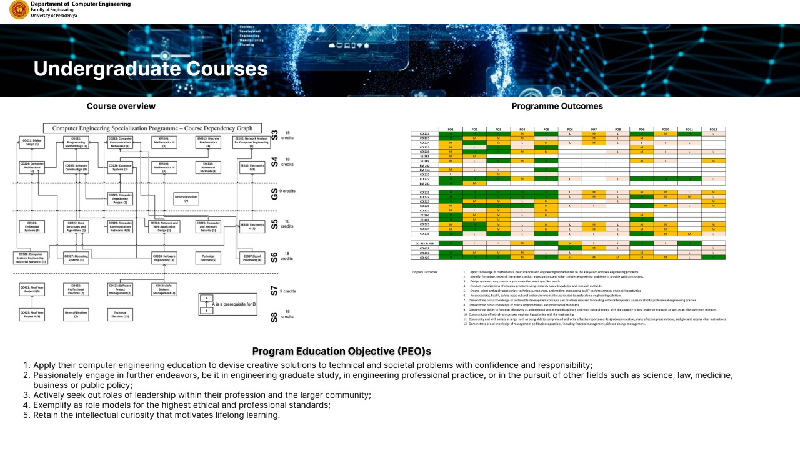
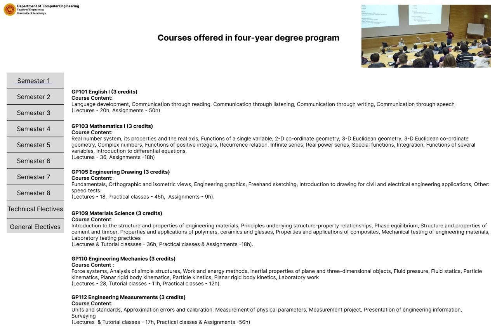

[comment]: # "This is the standard layout for the project, but you can clean this and use your own template"

# Department Course Page for Undergraduate Students

---

## Group 16 
#### Team Members
-  E/18/077, Dharmarathna N.S., [e18077@eng.pdn.ac.lk](mailto:e18077@eng.pdn.ac.lk)
-  E/18/224, Mihiranga G.D.R., [e18224@eng.pdn.ac.lk](mailto:e18224@eng.pdn.ac.lk)
-  E/18/227, Mudalige D.H., [e18227@eng.pdn.ac.lk](mailto:e18227@eng.pdn.ac.lk)

#### Project Owner
 Mr. Nuwan Jaliyagoda, [nuwanjaliyagoda@eng.pdn.ac.lk](mailto:nuwanjaliyagoda@eng.pdn.ac.lk)
 
#### Scrum Master
 Mr. Imesh Ekanayake, [imeshuk@eng.pdn.ac.lk](mailto:imeshuk@eng.pdn.ac.lk)
 
---

## Table of Contents
1. [Introduction](#introduction)
2. [Sub Topics 1](#sub-topics-1)
3. [Sub Topics 2](#sub-topics-2)
4. [Links](#links)

---

## Introduction

 description of the real world problem and solution, impact

## Sub Topics 1

TODO

## Sub Topics 2

TODO

---

## Links

- [Project Repository](https://github.com/cepdnaclk/{{page.repository-name}}){:target="_blank"}
- [Project Page](https://cepdnaclk.github.io/{{page.repository-name}}){:target="_blank"}
- [Department of Computer Engineering](http://www.ce.pdn.ac.lk/)
- [University of Peradeniya](https://eng.pdn.ac.lk/)

[//]: # (Please refer this to learn more about Markdown syntax)
[//]: # (https://github.com/adam-p/markdown-here/wiki/Markdown-Cheatsheet)

