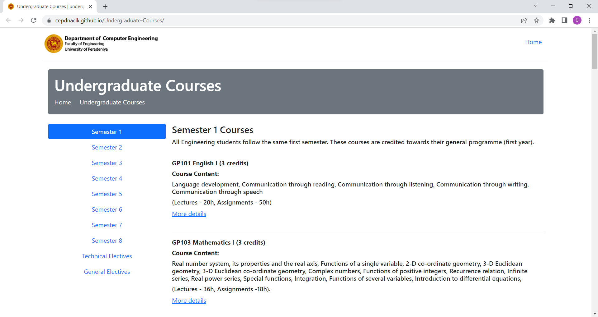
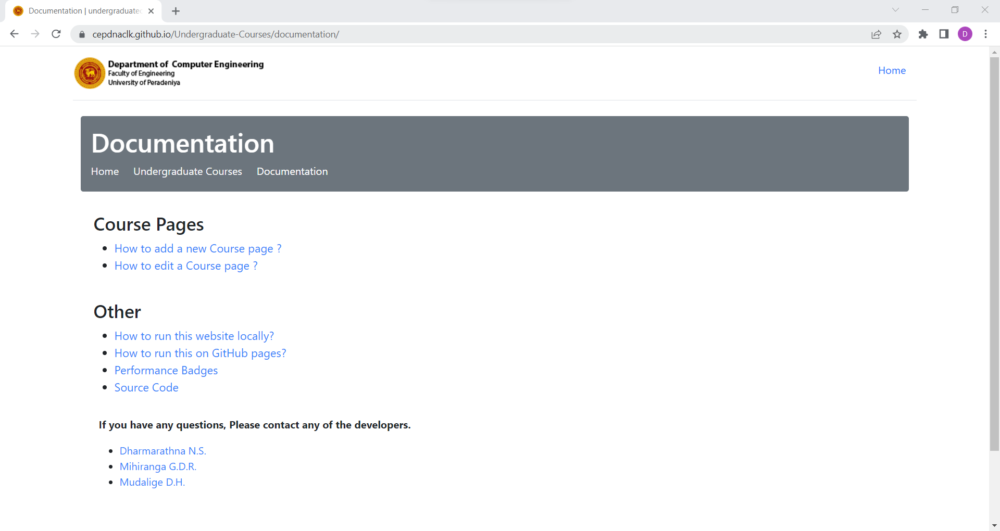

[comment]: # "This is the standard layout for the project, but you can clean this and use your own template"

# Department Course Page for Undergraduate Students

---

## Group 16 
#### Team Members
-  E/18/077, Dharmarathna N.S., [e18077@eng.pdn.ac.lk](mailto:e18077@eng.pdn.ac.lk)
-  E/18/224, Mihiranga G.D.R., [e18224@eng.pdn.ac.lk](mailto:e18224@eng.pdn.ac.lk)
-  E/18/227, Mudalige D.H., [e18227@eng.pdn.ac.lk](mailto:e18227@eng.pdn.ac.lk)

#### Project Owner
 Mr. Nuwan Jaliyagoda, [nuwanjaliyagoda@eng.pdn.ac.lk](mailto:nuwanjaliyagoda@eng.pdn.ac.lk)
 
#### Scrum Master
 Mr. Imesh Ekanayake, [imeshuk@eng.pdn.ac.lk](mailto:imeshuk@eng.pdn.ac.lk)

## Table of Contents
1. [Introduction](#introduction)
2. [Our Approach](#our-approach)
3. [Sub Topics 1](#sub-topics-1)
4. [Sub Topics 2](#sub-topics-2)
5. [Links](#links)

---

### Introduction

Course page of a department directly affect the first impression of an outsider. So making it more simple, interactive are some key features that many departments in various universities around the world trying to address. The aim of this project is to improve our undergraduate course page on the department website with more details, teacher-student interactions, and statistics of the previous years. 

---

### Our Approach

---

### Sub Topics 1

TODO

---

### Sub Topics 2

TODO

---

### Links

- [Project Repository](https://github.com/cepdnaclk/e18-co227-Department-Course-Page-Group-A)
- [Project Page](https://cepdnaclk.github.io/e18-co227-Department-Course-Page-Group-A/)
- [Department of Computer Engineering](http://www.ce.pdn.ac.lk/)
- [University of Peradeniya](https://eng.pdn.ac.lk/)

[//]: # (Please refer this to learn more about Markdown syntax)
[//]: # (https://github.com/adam-p/markdown-here/wiki/Markdown-Cheatsheet)

